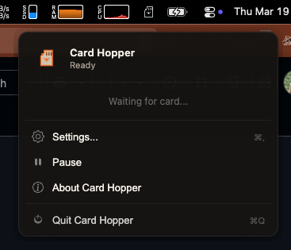
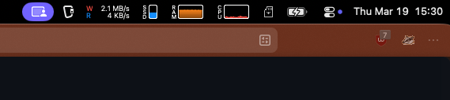
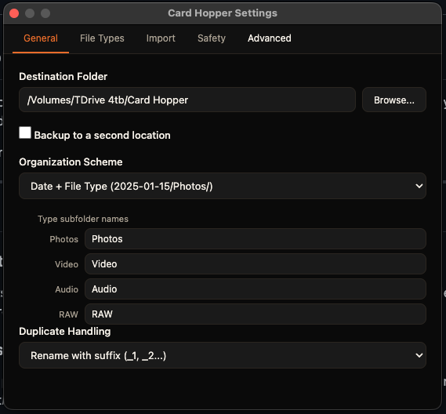
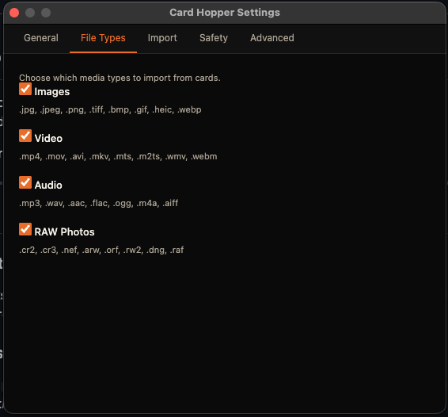
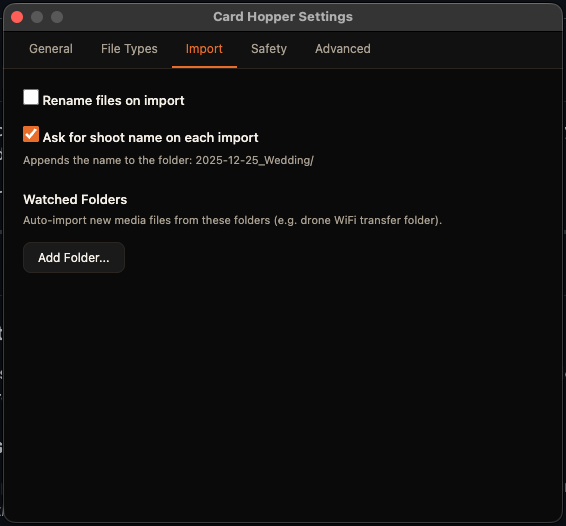
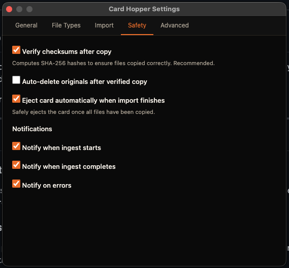
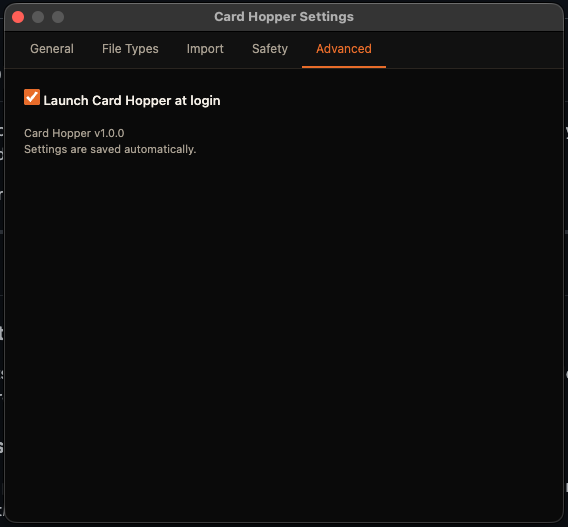

# Card Hopper

Menu bar app that auto-ingests SD cards. Insert a card, it copies everything to your destination folder, optionally ejects, done. No clicks.

Built with Electron — macOS, Windows, Linux.



---

## How it works

Card Hopper runs silently in your menu bar. When it sees a removable volume, it scans for media files and starts copying. You'll get a notification when it starts and when it finishes.

During a transfer you can click the menu bar icon to see live progress — speed, ETA, current file, bytes copied.



---

## Settings

**General** — Pick a destination folder. Optionally a second backup location. Choose how files get organized:

- `Date + File Type` → `2025-01-15/Photos/DSC05031.ARW`
- `Date only` → `2025-01-15/DSC05031.ARW`
- `Year / Month` → `2025/01/DSC05031.ARW`
- `Flat` — everything in one folder
- `Custom` — use tokens like `{year}/{month}/{label}`



**File Types** — Toggle images, video, audio, and RAW on or off individually.



**Import** — Optional shoot label prompt on each import (appends to folder name: `2025-12-25_Wedding/`). Watched folders for things like drone WiFi transfer or tethering directories.



**Safety** — SHA-256 checksum verification after every copy, auto-eject when done, auto-delete originals (off by default). Notification prefs.



**Advanced** — Launch at login.



---

## Install

Download from [Releases](#) and drag to Applications. First launch on macOS requires right-click → Open if unsigned.

### From source

```bash
git clone https://github.com/MANTREEJOE/cardhopper.git
cd cardhopper
npm install
npm start
```

### Build

```bash
npm run build:mac      # .dmg
npm run build:win      # .exe
npm run build:linux    # .AppImage
```

---

## File types

| | Extensions |
|--|--|
| Images | .jpg .jpeg .png .tiff .bmp .gif .heic .heif .webp |
| Video | .mp4 .mov .avi .mkv .mts .m2ts .wmv .flv .webm .m4v |
| Audio | .mp3 .wav .aac .flac .ogg .m4a .aiff |
| RAW | .cr2 .cr3 .nef .arw .orf .rw2 .dng .raf .pef .srw .x3f |

---

## Tech

Electron, Node.js crypto (SHA-256), chokidar, fs-extra, electron-store, electron-builder.

---

## Support

If this saves you time, [buy me a coffee](https://nathanbupte.com/tip).

---

MIT
